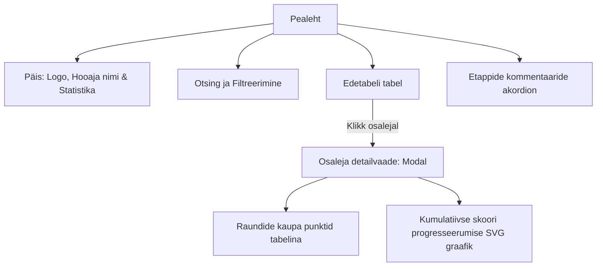
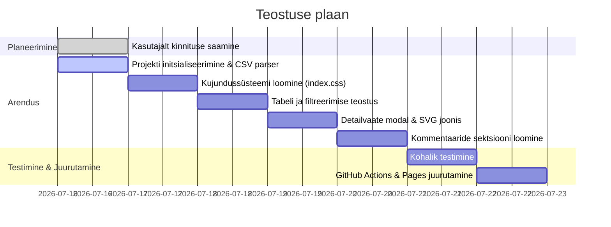

# Kardihooaaja Edetabel (Leaderboard) - Teostusplaan

Käesolev dokument kirjeldab iganädalaste hobikardivõistluste edetabeli veebirakenduse teostusplaani. Rakenduse eesmärk on esitada Google Sheetsis peetavat punktitabelit interaktiivsel, visuaalselt esmaklassilisel ja kasutajasõbralikul kujul, kasutades staatilist majutust (GitHub Pages).

---

## 1. Arhitektuur ja Tehnoloogiad

*   **Karkass (Framework):** Vite + React (SPA)
    *   Võimaldab luua kiire, modulaarse ja kergelt hooldatava kasutajaliidese.
*   **Kujundus (Styling):** Vanilla CSS (disainisüsteem CSS muutujatega)
    *   Tagab maksimaalse jõudluse ja täieliku kontrolli visuaalide üle ilma raskete raamistiketa.
*   **Andmete laadimine:** Otsene kliendipoolne päring (`fetch`) Google Sheetsi avalikustatud CSV-lõpppunktist:
    *   **URL:** `https://docs.google.com/spreadsheets/d/1reNQtxebHoXk72XMn7yTCgVLqbI2_-zDQpmm9Y3G9XM/export?format=csv`
    *   See lähenemine tagab, et tabeli uuendamisel kajastuvad andmed veebis koheselt ilma uue buildi vajaduseta.
*   **Graafikud:** Kohandatud interaktiivsed SVG joonised (ilma väliste suurtet teekideta nagu Chart.js, et hoida maht minimaalne ja laadimiskiirus maksimaalne).
*   **Majutus:** GitHub Pages (staatiline HTML/JS/CSS).

---

## 2. Andmetöötluse loogika

1.  **CSV parsimine:**
    *   Eemaldatakse tabeli alguses olevad abiread (hoiatused, üldised pealkirjad).
    *   Tuvastatakse veergude päised (Koht, Nimi, Etappide nimed, Kokku).
    *   Iga osaleja kohta eraldatakse tema nimi, koht, etappide individuaalsed punktid ning 9 parima etapi summa.
2.  **Andmete puhastamine ja valideerimine:**
    *   Tühjad lahtrid või vigased väärtused (nt `#N/A`) teisendatakse väärtuseks `0` või tühjaks stringiks.
    *   Punktid konverteeritakse ujukomaarvudeks (nt `20.5` -> `20.5`).
3.  **Sorteerimine ja filtreerimine:**
    *   Tabel toetab sorteerimist kõikide veergude järgi (vaikimisi koha järgi kasvavalt).
    *   Otsingufunktsioon filtreerib osalejaid nime järgi reaalajas.

---

## 3. Disainisüsteem ("Carbon Racing" Dark Mode)

Kujunduses kasutatakse tumedat võidusõiduteemalist esteetikat:

*   **Värvipalett:**
    *   Taust: `#0d0f12` (sügav süsinikmust) ja `#161a22` (tumehall kaarditaust)
    *   Neon-aktsendid (võidusõidu detailid): `#00e5ff` (digitaalne sinine), `#ffeb3b` (kollane lipuvärv)
    *   Tekst: `#f0f3f6` (puhas valge pealkirjadele), `#98a2b3` (hall abitekstidele)
    *   **Poodiumikohad (Top 3 esiletõstmine):**
        *   1. Koht (Kuld): Kuldne gradient taustal (`linear-gradient(135deg, #ffd700, #b8860b)`), tume tekst, kuldne sära/vari.
        *   2. Koht (Hõbe): Hõbedane gradient (`linear-gradient(135deg, #c0c0c0, #708090)`), hõbedane sära.
        *   3. Koht (Pronks): Pronksjas/oranžikas gradient (`linear-gradient(135deg, #cd7f32, #8b4513)`), pronksjas sära.
*   **Tüpograafia:** Modernsed ja puhtad kirjafondid (nt *Outfit* või *Inter* Google Fontsist).
*   **Interaktsioonid:**
    *   Ridade kohal hõljumisel (*hover*) sujuv heledamaks muutumine ja nihkumine.
    *   Sorteerimise päiste klikkimisel mikromuutused ikoonides.
    *   Modalakende avanemisel sujuvad hajumise (*fade-in*) ja skaalaüleminekud.

---

## 4. Kasutajaliidese Struktuur (Lehe ülesehitus)

### A. Päis ja Kiirstatistika
*   Hooaja pealkiri: `mmv-HKS 2026`
*   Statistikakaardid:
    *   *Sõitjate arv kokku*
    *   *Toimunud etappe* (mitmel etapil on vähemalt ühel sõitjal punktid olemas)
    *   *Liider* (kõige suurema punktisummaga sõitja nimi)

### B. Edetabel
*   Veerud:
    *   `Koht` (positsioon, kuvatakse medaliga Top 3 puhul).
    *   `Sõitja` (nimi).
    *   `Etapid` (Õismäe, Laagri, Aravete jne. Veerud on dünaamilised vastavalt CSV struktuurile).
    *   `Kokku` (kõige olulisem võrdlusnäitaja).
*   Funktsioonid:
    *   Päise klõpsamisel sorteeritakse tabel vastava veeru järgi (kasvavalt/kahanevalt).
    *   Sõitja rea kohal hõljumisel ilmub vihje: *"Klõpsa detailideks"*.

### C. Osaleja detailvaade (Modal)
*   Avaneb sõitja reale klõpsates.
*   Sisaldab:
    *   **Profiili kokkuvõte:** Nimi, praegune koht, parim etapi tulemus, keskmine punktisumma etapi kohta.
    *   **Kumulatiivne graafik (SVG Line Chart):** Näitab joongraafikul skoori kasvamist läbi etappide (nt 0 -> 20.5 -> 27.0 -> 43.0 ...).
    *   **Tulemuste tabel:** Kõik etapid kronoloogilises järjekorras koos punktidega.

### D. Etappide kommentaarid
*   Lehe allosas asuv kokkuvolditav akordion (Accordion).
*   Kuvab raja korraldajate märkmeid kardi käitumise või rajaolude kohta (nt *"Kart nr1 tõrkus..."*), mis on kirjas CSV alumises jaotises.

---

## 5. Teostuse faasid

### Faas 1: Projekti ettevalmistus
*   Vite + React projekti failide loomine käsitsi (vältides üleliigset prahti).
*   CSV parsimise utiliidi kirjutamine (`src/utils/csvParser.js`), mis suudab tuvastada andmete vahemiku ja kommentaarid eraldi.

### Faas 2: Disainisüsteem ja Pealeht
*   `src/index.css` loomine võidusõidu esteetika ja gradientidega.
*   Tabeli komponendi arendus: sorteerimise loogika ja otsingu integreerimine.

### Faas 3: Interaktiivsus
*   Sõitja profiili modali teostus.
*   SVG graafiku matemaatika ja renderdamine (arvutab kumulatiivse punktisumma punkt-punktilt ja renderdab elegantse animeeritud SVG joone).

### Faas 4: Kommentaarid ja viimistlus
*   Kommentaaride jaotise loomine lehe jalusesse.
*   Mobiilisõbralikkuse (responsive layout) testimine ja tabeli kerimise parandamine kitsastel ekraanidel.

### Faas 5: Juurutamine (Deployment)
*   GitHub Actions faili loomine `.github/workflows/deploy.yml`, mis teostab automaatse buildi ja pushib selle `gh-pages` branchi.
